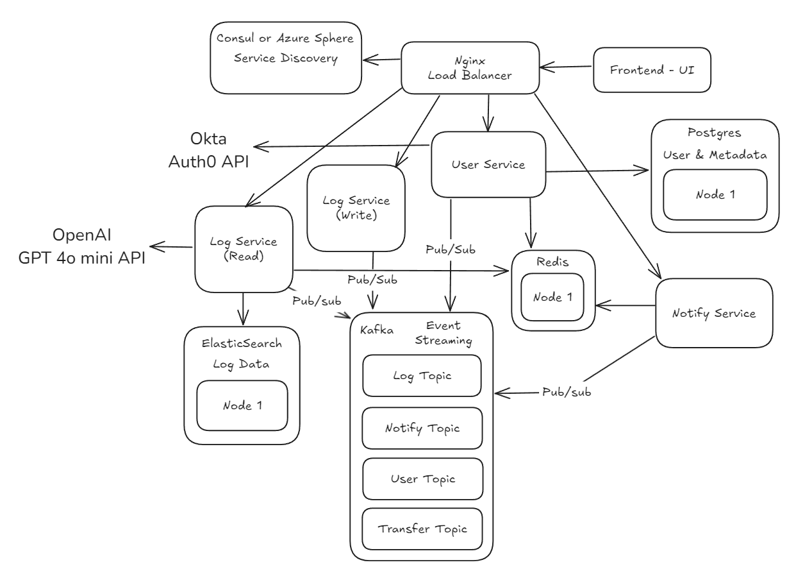
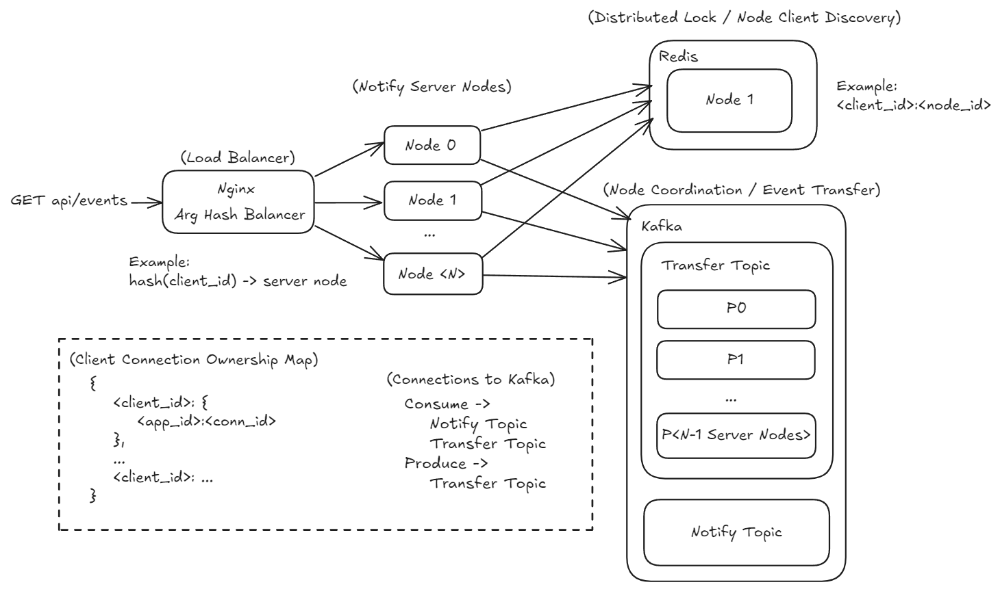
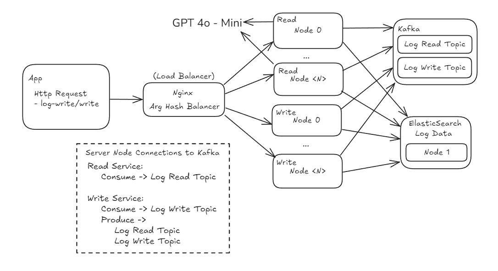

# Prism Server

## Project Overview

PRISM is a multi-tenant DevOps and observability tool designed to capture metrics from multiple real-time cloud containers and display them on a user-friendly interface. It features an alerting system, log analysis capabilities, and high security through OAuth integration.

## Contributors

- Tuan Trinh
  - [linkedin](https://www.linkedin.com/in/tuan882612/)
  - [github](https://github.com/tuan882612)
- Dhrutik Solanki
  - [linkedin](https://www.linkedin.com/in/dhrutik0602/)
  - [github](https://github.com/DhrutikS257)

## Table of Contents

- [Prism Server](#prism-server)
  - [Project Overview](#project-overview)
  - [Contributors](#contributors)
  - [Table of Contents](#table-of-contents)
  - [Architectural Design](#architectural-design)
  - [Advanced Component System Design](#advanced-component-system-design)
    - [Notify Service SSE Design](#notify-service-sse-design)
    - [Log Service Design](#log-service-design)
  - [Prerequisites](#prerequisites)
  - [How To Run The Server](#how-to-run-the-server)
  - [Project Structure](#project-structure)

## Architectural Design

In this architecture, services communicate asynchronously through events, promoting loose coupling and scalability. This design efficiently handles real-time metrics and log collection from multiple cloud containers or pushing real-time notifications to the frontend.



The PRISM server employs an event-driven microservices architecture, consisting of the following services:

- **User Service**: Handles user authentication and authorization.
- **Log Write Service** (Collector): Collects logs from cloud containers and stores them in Elasticsearch.
- **Log Read Service** (Reader): Retrieves logs from Elasticsearch, does analysis and sends them to the frontend.
- **Notify Service**: Sends (smtp) emails to the user or real-time server-sent events (SSE) notifications to the frontend when alerts are triggered.

## Advanced Component System Design

### Notify Service SSE Design



### Log Service Design



## Prerequisites

- Docker Requirements:
    > installation link [docs.docker.com/desktop/](https://docs.docker.com/desktop/)
    1. Docker Engine
    2. Docker CLI Client
    3. Docker Desktop
- Auth0 Account:
    > sign up for a free account at [auth0.com](https://auth0.com/)

## How To Run The Server

1. Clone the repository

    ```bash
    gh repo clone prism-o11y/prism-server
    # or
    git clone https://github.com/prism-o11y/prism-server.git
    ```

2. Ensure environment variables are set
    load the environment variables from in the format of `.env.example` to `.env` in the `assets/env` directory.

3. Run the server

    ```bash
    docker compose -f compose.app.yml -f compose.infra.yml -f compose.mgmt.yml up
    ```

    Example: detailed step-by-step guide for 5 notify node setup:

   1. Cleanup existing

        ```plaintext
        docker compose -f compose.infra.yaml -f compose.app.yaml -f compose.mgmt.yaml down -v
        ```

   2. Setup initial infra

        ```plaintext
        docker compose -f compose.app.yaml -f compose.infra.yaml -f compose.mgmt.yaml up db elasticsearch zookeeper cache kafka kafka-init --build
        ```

   3. Run the services

        ```plaintext
        docker compose -f compose.app.yaml -f compose.infra.yaml up alert-noti-service-1 alert-noti-service-2 alert-noti-service-3 alert-noti-service-4 alert-noti-service-5 user-service log-write-service log-read-service --build
        ```

   4. Run Consul and Nginx

        ```plaintext
        docker compose -f compose.app.yaml -f compose.infra.yaml up consul nginx --build
        ```

## Project Structure

```plaintext
.
├── alert-noti-service
│   ├── cmd
│   │   └── prism
│   ├── internal
│   │   ├── conf
│   │   ├── depends
│   │   ├── notify
│   │   │   ├── models
│   │   │   ├── smtp
│   │   │   │   └── templates
│   │   │   └── sse
│   │   │       └── lock
│   │   └── server
│   └── pkg
│       └── server
├── assets
│   ├── data
│   │   └── test
│   ├── env
│   └── nginx
│       └── conf.d
│           ├── common
│           ├── sites
│           └── upstreams
├── log-read-service
│   ├── cmd
│   │   └── prism
│   └── internal
│       ├── conf
│       ├── depends
│       └── server
├── log-write-service
│   ├── cmd
│   │   └── prism
│   └── internal
│       ├── collector
│       ├── conf
│       ├── depends
│       └── server
├── shared
│   ├── data
│   │   ├── elastics
│   │   ├── kafka
│   │   └── rconn
│   └── server
└── user-service
    ├── scripts
    ├── sql
    ├── src
    │   ├── api
    │   │   └── v1
    │   ├── config
    │   ├── database
    │   ├── jwt
    │   ├── kafka
    │   ├── server
    │   └── svc
    │       ├── apps
    │       ├── auth
    │       ├── org
    │       ├── sse
    │       └── user
    └── test
```
